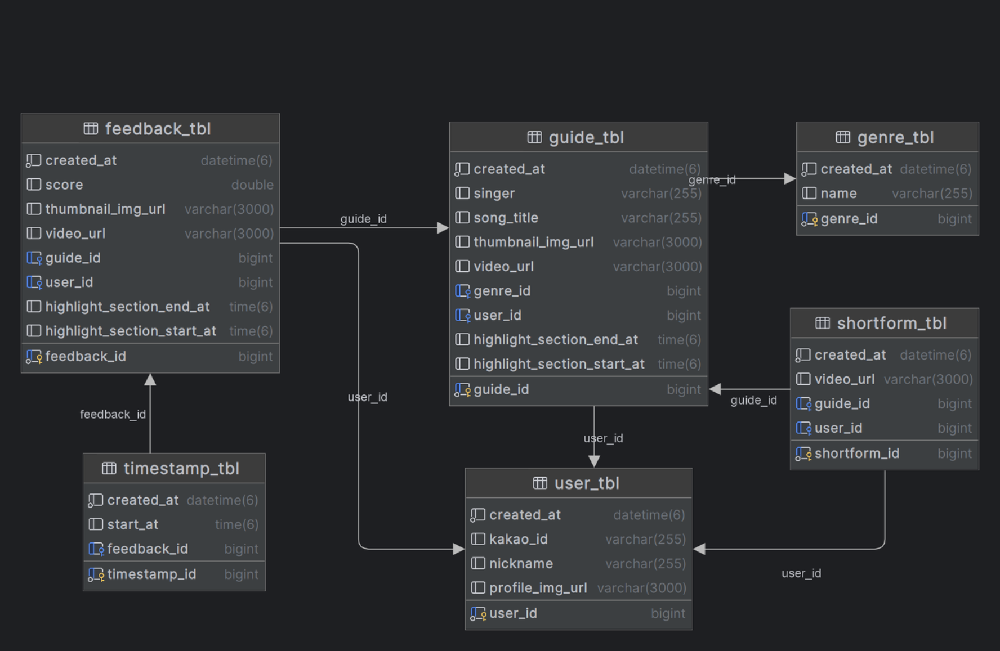
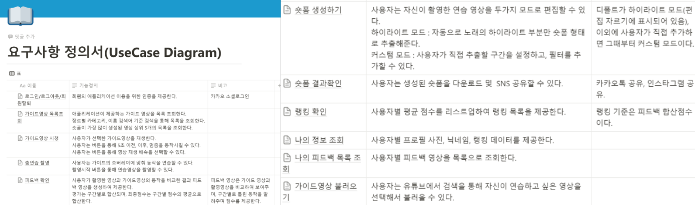
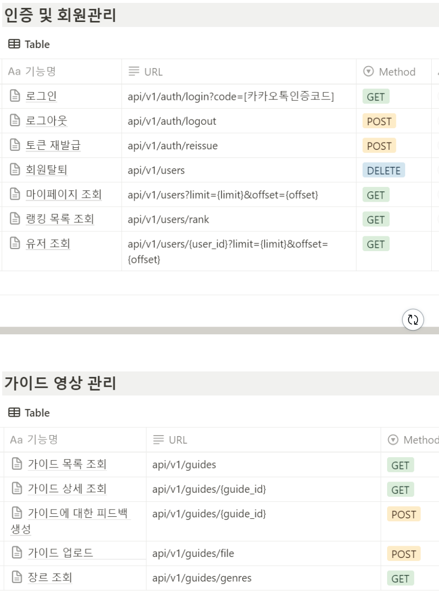
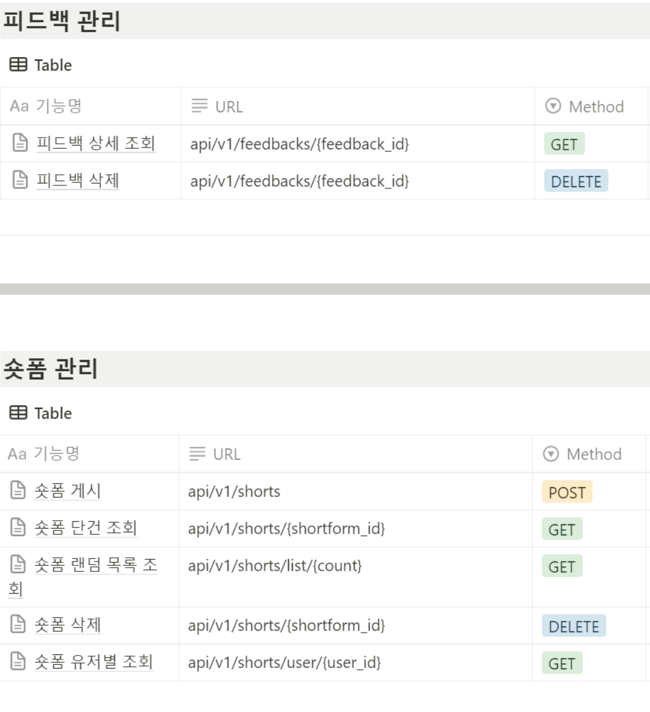
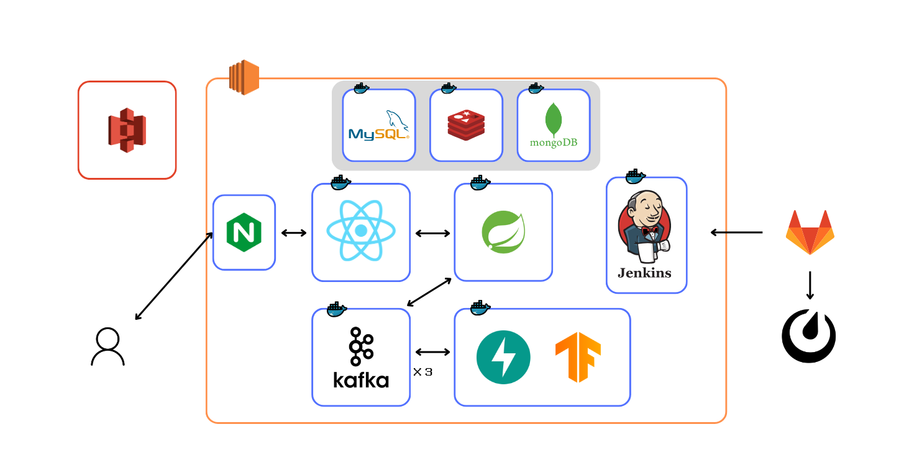

# STEP TO DANCE

### AI 댄스 선생님 및 숏폼 생성 공유 플랫폼

  

## 서비스 개요

### 서비스 설명

저희 서비스를 이용해 사람들이 다양한 수준의 춤을 영상을 통해서 배울 수 있으며, 우리의 앱은 모션 인식 기술로 사용자의 춤을 분석하고 즉각적인 피드백을 제공합니다. 사용자는 자신의 춤을 숏폼 비디오로 변환해 소셜 미디어에 업로드할 수 있어, 자기 계발과 커뮤니티와의 소통이 가능합니다.

### 기획 배경

춤에 대한 관심이 급증하는 현대 사회에서, 기술을 통해 누구나 쉽고 재미있게 춤을 배우고 연습할 수 있는 환경을 제공하고자 해당 주제를 선정하였습니다. 최근 몇 년간 춤 관련 숏폼 콘텐츠의 인기가 폭발적으로 증가함에 따라, 사용자들이 춤 실력을 개발하고 공유할 수 있는 플랫폼에 대한 수요가 크게 증가하였습니다. 이러한 배경을 바탕으로, 모션인식 기술을 활용해 사용자의 춤에 대한 피드백을 제공하고, SNS에 공유할 수 있게 함으로써, 더 많은 사람들이 춤에 접근하고 즐길 수 있도록 하기 위해 프로젝트를 기획하게 되었습니다.

### 기대 효과

- 숏폼 생성으로 사용자 편의성 향상
- 시공간의 제약 없는 학습 인프라 구축
- 랭킹 시스템을 통한 재미 향상
- SNS 공유로 커뮤니티 활성화

## 서비스 화면 및 기능 소개

### 가이드 영상 시청

### 영상 촬영

### 피드백 생성

### 숏폼 편집

### 숏폼 조회

### 가이드 업로드

## 기술 스택

> ## Frontend

### React

- React 18.3.1
- Vite 5.2.0
- emotion 11.11.4
- material 5.15.15
- redux 2.2.3
- axios 1.6.8
- react-dom 18.3.1
- react-router-dom 6.23.0
- styled-components 6.1.8
- three 0.164.1
- vite-plugin-pwa 0.19.8
  > ## Backend

### Spring 서버

- Springboot 3.2.4
- Spring Data JPA
- Spring Data mongodb
- Spring Data redis
- Spring Security
- Spring Kafka 3.1.3
- JWT
- Java JDK 17
- QueryDSL 5.0.0
- AWS S3
- gson 2.10.1

### Fast Api 서버

- Python 3.11.2
- pip 22.3.1
- fastapi 0.110.2
- uvicorn 0.29.0
- confluent_kafka 2.3.0
- redis 5.0.4
- tensorflow 2.16.1
- tensorflow_hub 0.16.1
- opencv-python 4.9.0
  > ## AI
- Openpose
- Movenet thunder
  > ## 인프라

### CI/CD

- AWS EC2
- AWS S3
- jenkins 2.454
- Docker 26.1.0
- NginX 1.18.0 (Ubuntu)
- MatterMost Webhook
- GitLab Webhook
- MySQL 8.0.36
- Redis 7.2.4
  > ## 기타

### 이슈 관리

- Jira

### 형상 관리

- Git, Gitlab

### 소통, 협업

- Notion
- Mattermost

### 개발 환경

- OS: Windows 10
- IDE: Intellij, VSCode
- EC2: Ubuntu 20.04.6 LTS (GNU/Linux 5.15.0-1051-aws x86_64)
- Reverse Proxy: Nginx
- SSH: WSL , MobaXterm
- SSL: CertBot, Let’s Encrypt

## 프로젝트 산출물

### ERD

  

### 요구사항 정의서

  

### API 명세서

  
  

### 시스템 설계서

  

## 팀원 소개

> <h3>Front-End</h3>

<table>
 <tr>
    <td align="center"></td>
    <td align="center"></td>
    <td align="center"></td>
  </tr>
  <tr>
    <td align="center"><a href="https://github.com/1234jienf"><b>백지윤</b></a></td>
    <td align="center"><a href="https://github.com/choikeunyoung"><b>최근영</b></a></td>
    <td align="center"><a href="https://github.com/namoo1818"><b>이민지</b></a></td>
  </tr>
  <tr>
    <td align="center">팀장</td>
    <td align="center"></td>
    <td align="center"></td>
  </tr>
</table>

> <h3>Back-End</h3>

<table>
 <tr>
    <td align="center"></td>
  </tr>
  <tr>
    <td align="center"><a href="https://github.com/"><b>황진하</b></a></td>
  </tr>
  <tr>
    <td align="center"></td>
  </tr>
</table>

## 🏷 License

This software is licensed under the MIT <a href="https://www.ssafy.com/ksp/jsp/swp/swpMain.jsp" _blank="new">©SSAFY</a>.

